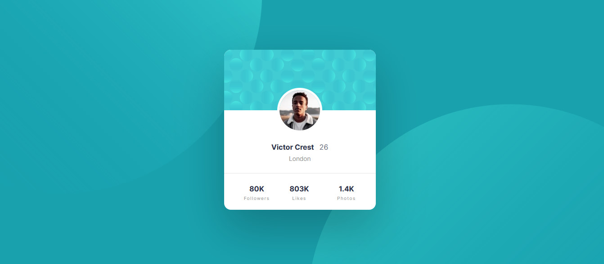

# Frontend Mentor - Profile card component solution

This is a solution to the [Profile card component challenge on Frontend Mentor](https://www.frontendmentor.io/challenges/profile-card-component-cfArpWshJ). Frontend Mentor challenges help you improve your coding skills by building realistic projects. 

## Table of contents

- [Overview](#overview)
  - [The challenge](#the-challenge)
  - [Screenshot](#screenshot)
  - [Links](#links)
- [My process](#my-process)
  - [Built with](#built-with)
  - [What I learned](#what-i-learned)
  - [Continued development](#continued-development)
  - [Useful resources](#useful-resources)
- [Author](#author)

## Overview

### The challenge

- Build out the project to the designs provided

### Screenshot

### Links

- [Solution URL](https://www.frontendmentor.io/solutions/time-tracking-dashboard-using-htmlcss-js-asyncawait-and-transition-d1kL5GKaT)
- [Live Site URL](https://mohsin316.github.io/Time-tracking-dashboard/)

## My process

### Built with

- Semantic HTML5 markup
- CSS custom properties
- Flexbox
- CSS Grid
- Mobile-first workflow

### Continued development

For future plans for now its to do more and more javascript. I just recently finished a course for it and i want to use my new hand skills and make amazing projects. super glad font end mentor exists. After playing around with Js i might study a framework or start a little bit on the backend. In fact i was considering looking up a few videos on using Figma and learn how to design proper websites.

### Useful resources

- [net ninja](https://netninja.dev/courses) - This helped me for Studying javascript. I really liked this course and i highly recommend to begginers.
- [Kevin Powell](https://www.youtube.com/kepowob) - This person is extremely talented and has helped me learn most of the things i know in CSS. highly recommend to anyone who is studying CSS.

## Author

- [My website](https://mohsins-solutions.netlify.app/)
- Frontend Mentor - [@mohsin316](https://www.frontendmentor.io/profile/mohsin316)
- Twitter - [@Mohsin_316](https://twitter.com/Mohsin_316)
- Instagram - [@mohsin.k21](https://www.instagram.com/mohsin.k21/)